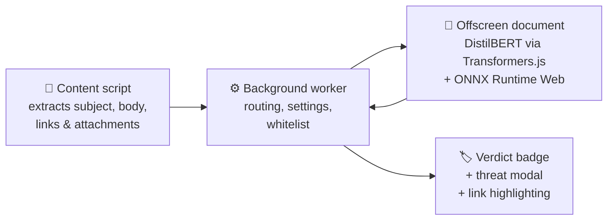

<div align="center">

# 🎣 PhishNet

**Catch phishing before it catches you.**

A privacy-first Chrome extension that detects phishing emails inside Gmail and
Outlook using a DistilBERT transformer running **entirely on your device**.

[](https://github.com/anubhavaanand/PhishNet/actions/workflows/ci.yml)
[](LICENSE)
[](https://developer.chrome.com/docs/extensions/mv3/)
[](#testing)
[](CONTRIBUTING.md)

[Website](https://anubhavaanand.github.io/PhishNet/) · [Install](#-install) · [How it works](#-how-it-works) · [Privacy](#-privacy) · [Report a bug](https://github.com/anubhavaanand/PhishNet/issues)

</div>

---

## Why PhishNet?

Every "email security" tool faces the same trade-off: to analyze your mail, it
wants your mail on its servers. PhishNet refuses that trade — the model runs in
your browser, so **we couldn't read your inbox even if we wanted to.**

| Typical cloud scanners | PhishNet |
| --- | --- |
| ☁️ Emails uploaded to third-party APIs | 🔒 100% on-device inference |
| 📋 Static blocklists, stale in days | 🧠 Transformer + heuristic engines |
| 💰 Enterprise pricing | 🆓 Free & open source (MIT) |

## ✨ Features

- 🛡️ **Inline verdict badges** — every opened email gets an instant Safe / Phishing / Uncertain badge with confidence score
- 🔍 **Threat Inspector** — click any badge for urgency score, domain trust, link-by-link forensics and attachment risk
- 🔗 **Spoofed link detection** — homograph (Cyrillic lookalikes), punycode, typosquatting via Levenshtein distance against 25+ major brands, display-text mismatch, shorteners, suspicious TLDs
- 📎 **Attachment analyzer** — executables, scripts, ISO images and deceptive double extensions (`invoice.pdf.exe`)
- ⭐ **Trusted senders** — whitelist domains or addresses; trusted mail is marked instantly
- 🌙 **Dark-mode UI** — glassmorphic badges, modal inspector and popup dashboard that match Gmail/Outlook dark themes
- 📊 **Local dashboard** — scan history and threat stats, stored only on-device

Works with **Gmail**, **Outlook.com** and **Office 365 (OWA)** on desktop Chromium browsers.

## 🚀 Install

> The AI model (~50 MB) downloads automatically on first scan and is cached locally forever after.

### Option A — Download ZIP (no git needed)

1. On the [repo page](https://github.com/anubhavaanand/PhishNet), click **Code → Download ZIP**, then unzip it
2. Open `chrome://extensions` and enable **Developer mode**
3. Click **Load unpacked** and select the unzipped `PhishNet-main` folder

### Option B — Git

```bash
git clone https://github.com/anubhavaanand/PhishNet.git
```

Then steps 2–3 above with the cloned folder.

### Verify it works

Open any email → a badge appears next to the sender within a second:
🛡️ Safe · ⚠️ Phishing · ❓ Uncertain · ⭐ Trusted. Click it for full forensics.

## 🧠 How it works



The classifier is [`cybersectony/phishing-email-detection-distilbert_v2.4.1`](https://huggingface.co/cybersectony/phishing-email-detection-distilbert-v2.4.1),
quantized to int8 (~50 MB), served through Transformers.js v3 and executed by
ONNX Runtime Web inside an isolated offscreen document. If the model can't load,
a rule-based engine (urgency scoring, lookalike domains, attachment analysis)
keeps protecting you — same UI, same badges.

## 🔒 Privacy

- ✅ Zero network requests during inference — text never leaves the tab
- ✅ Model weights fetched once from Hugging Face, then cached locally
- ✅ No analytics, telemetry or tracking of any kind
- ✅ History, stats and whitelist live only in browser storage; clearable in one click
- ✅ Fully open source — audit every line

Full details in [PRIVACY_POLICY.md](PRIVACY_POLICY.md).

## 🧪 Testing

20 unit tests cover the detection engine (typosquatting, homographs,
attachments, official-domain false-positive regressions), provider selectors
and utilities:

```bash
node tests/unit.test.js
```

CI runs syntax validation for every context (ESM service worker/offscreen vs.
classic content scripts), MV3 CSP compliance checks, manifest integrity and the
full test suite on every push.

## ⚡ Performance

| Metric | Value |
| --- | --- |
| Heuristic fallback scan | ~27 µs (37,000 scans/sec) |
| ML inference (after warm-up) | ~200 ms per email |
| Extension code (excl. bundled runtime) | ~70 KB |
| Memory footprint | Single observer, debounced scans, idle-coalesced DOM work |

## 🛠️ Tech stack

| Layer | Technology |
| --- | --- |
| ML | Transformers.js v3, ONNX Runtime Web, quantized DistilBERT |
| Platform | Chrome Extension Manifest V3, offscreen documents, service worker |
| Detection engine | Vanilla JS heuristics — Levenshtein, Unicode script mixing, extension analysis |
| Quality | Node test runner, GitHub Actions CI |

## ❓ FAQ

<details>
<summary><b>Does my email ever leave my computer?</b></summary>
No. Inference happens entirely in your browser. The only network fetch is the one-time model download from Hugging Face's CDN.
</details>

<details>
<summary><b>Why is the first scan slow?</b></summary>
Chrome fetches the ~50 MB quantized model once and caches it. Every later scan — including offline — runs locally in ~200 ms.
</details>

<details>
<summary><b>Does it work on mobile?</b></summary>
Any Chromium browser that supports MV3 extensions (e.g. Kiwi on Android, Orion on iOS) can load it. The UI uses 44 px+ touch targets.
</details>

<details>
<summary><b>A safe email was flagged — why?</b></summary>
Heuristics are conservative with lookalike domains and urgent language. Click the badge to see exactly which signals fired, then add legitimate senders to Trusted Senders.
</details>

## 🤝 Contributing

Issues and PRs welcome — see [CONTRIBUTING.md](CONTRIBUTING.md). For security
disclosures, please follow [SECURITY.md](SECURITY.md).

## 📄 License

[MIT](LICENSE) © Anubhav Anand

---

<div align="center">
<sub>Built with 🎣 for the Pixel Forge AI Hackathon · <a href="https://github.com/anubhavaanand/PhishNet">Star the repo if it saved you from a phish</a></sub>
</div>
